### exp 1

iter 20

img 64 house

stride 2

sigma 10

block 8

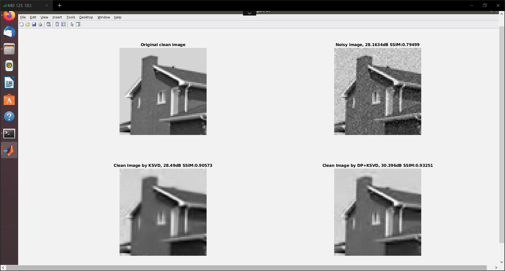

### exp 2

iter 20

img 64 lena

stride 2

sigma 10

block 8

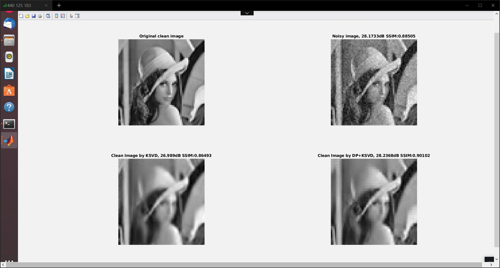

### exp 3

iter 20

img 64 Barbara

stride 2

sigma 10

block 8

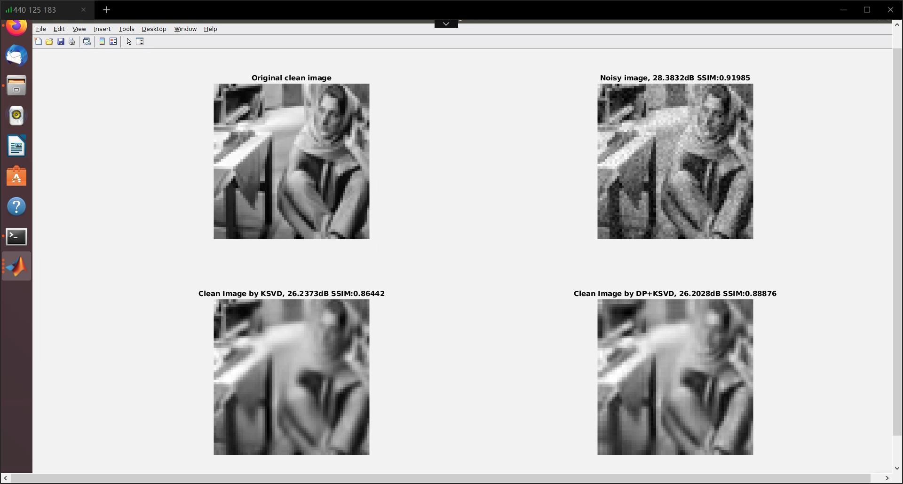

### exp 4

iter 10

img 64 house

stride 1

sigma 10

block 8

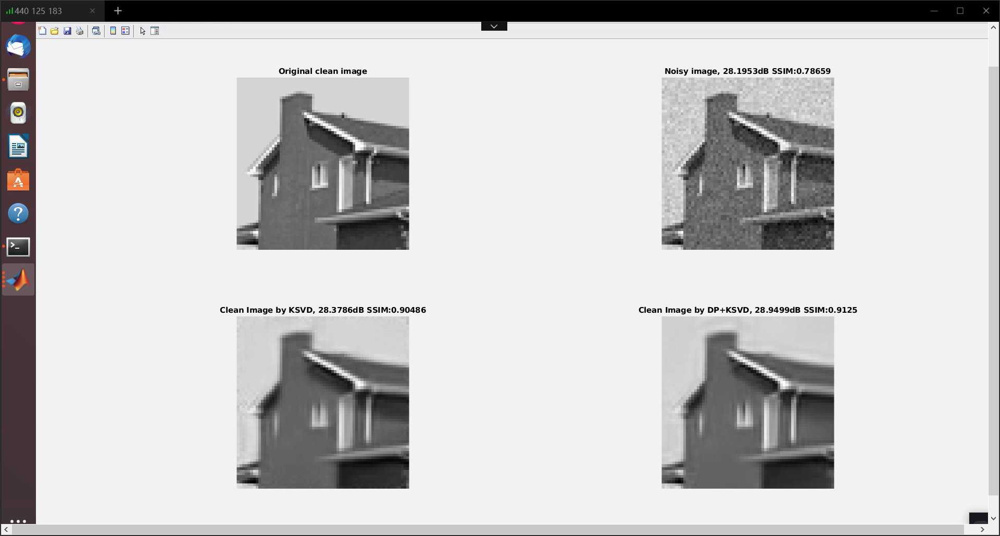

### exp 5

iter 10

img 128 house

stride 4

sigma 10

block 8

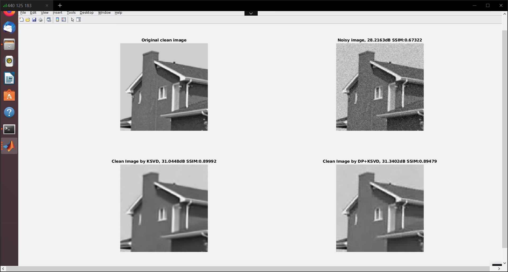

### exp 6 (DP+KSVD)

KSVD iter 10

DP iter 5

img 32 house

stride 1

sigma 10

block 8

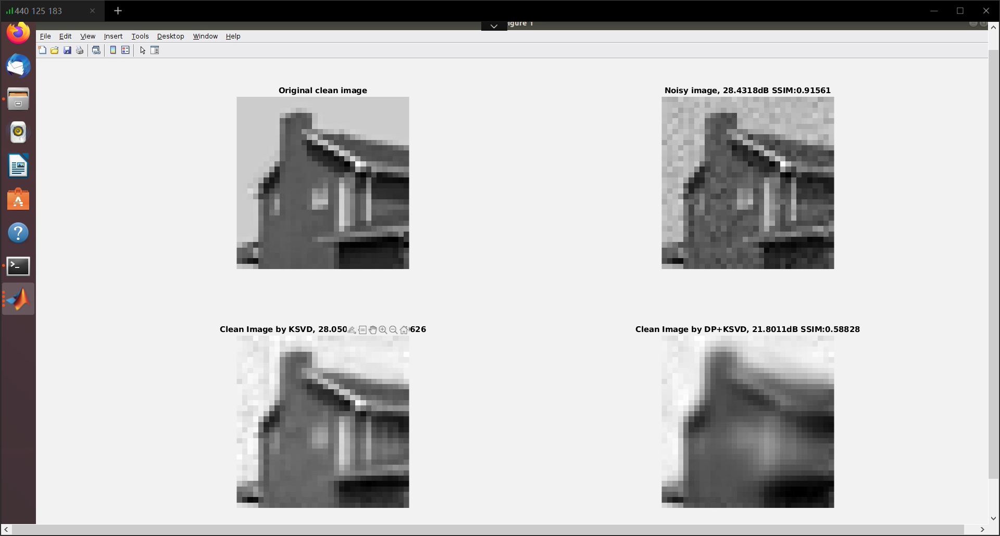

initial kappa in a new way

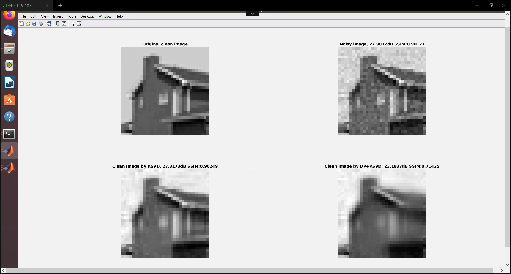

### exp 6 (DP)

DP iter 5

img 32 house

stride 1

sigma 10

block 8

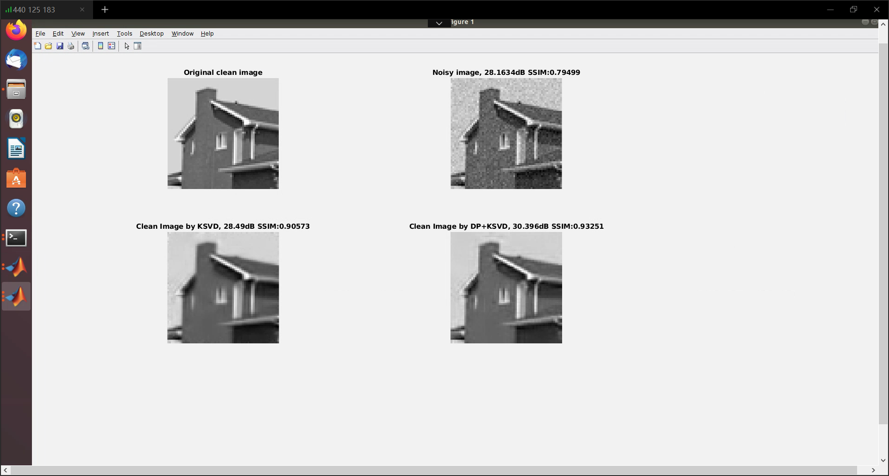

### exp 7

DP iter 1

ksvd iter 2

img 133 taken from 512 image lena compressed to 32

stride 1

sigma 10

block 8

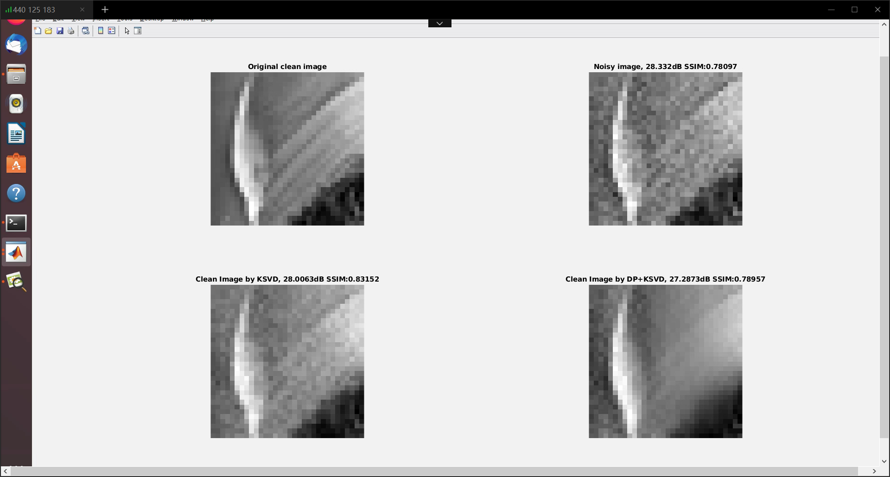

### exp 8.1

DP iter 1

ksvd iter 2

img 64 taken from 512 image house compressed to 32

stride 1

sigma 10

block 8

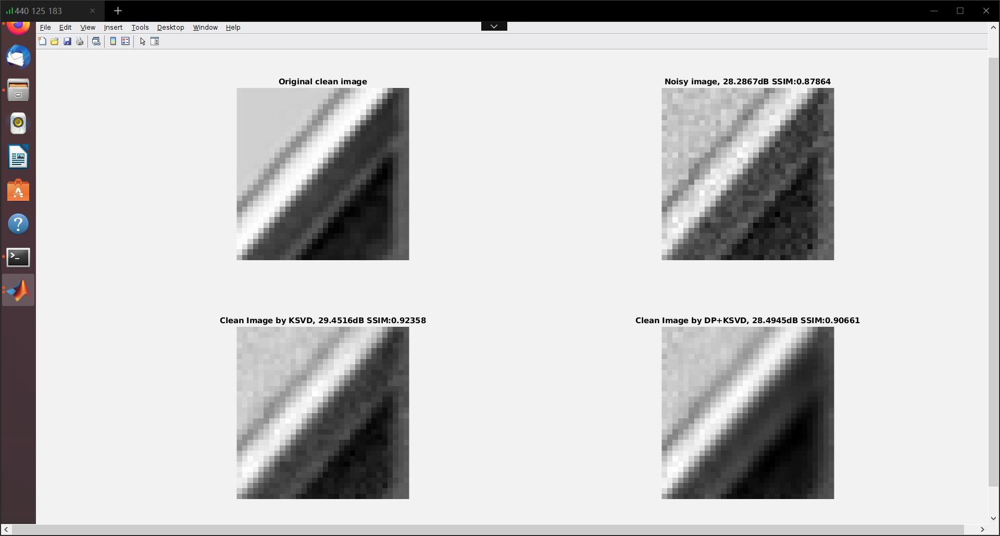

### exp 8.2

DP iter 1

ksvd iter 2

img 64 taken from 512 image house

stride 1

sigma 10

block 8

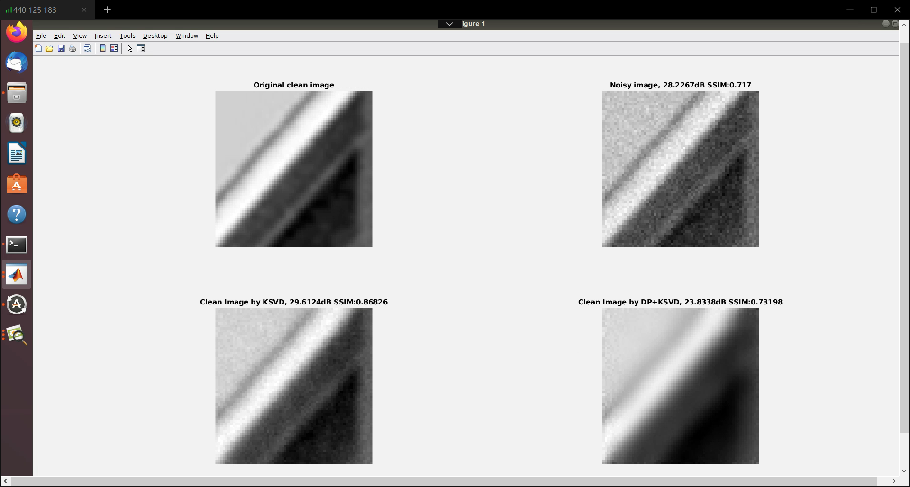
